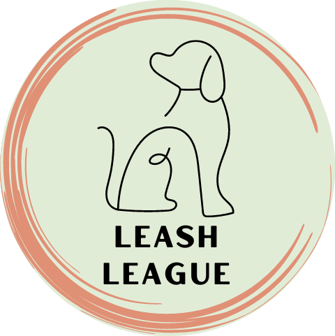
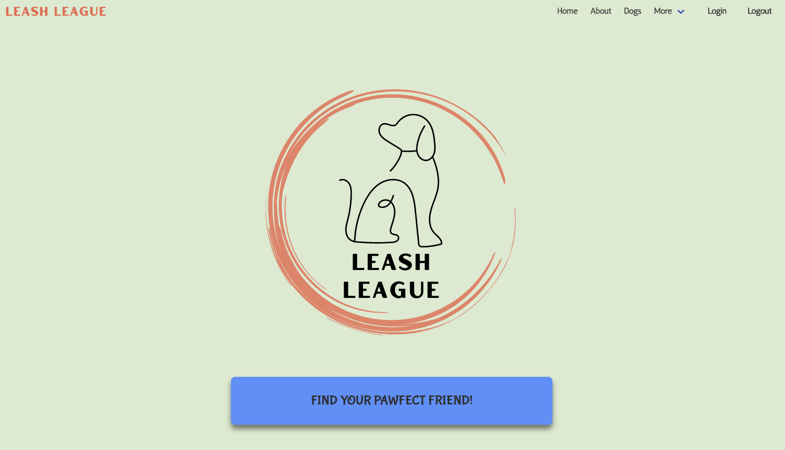

<!-- Improved compatibility of back to top link: See: https://github.com/othneildrew/Best-README-Template/pull/73 -->
<a name="readme-top"></a>
<!--
*** Thanks for checking out the Best-README-Template. If you have a suggestion
*** that would make this better, please fork the repo and create a pull request
*** or simply open an issue with the tag "enhancement".
*** Don't forget to give the project a star!
*** Thanks again! Now go create something AMAZING! :D
-->


<!-- PROJECT SHIELDS -->
<!--
*** I'm using markdown "reference style" links for readability.
*** Reference links are enclosed in brackets [ ] instead of parentheses ( ).
*** See the bottom of this document for the declaration of the reference variables
*** for contributors-url, forks-url, etc. This is an optional, concise syntax you may use.
*** https://www.markdownguide.org/basic-syntax/#reference-style-links
-->
<!-- PROJECT LOGO -->
<br />
<div align="center">
  <a href="https://github.com/github_username/repo_name">
    
  </a>

<h3 align="center">Leash League</h3>

  <p align="center">
We have created what we believe is a great starting point in choosing your new best friend. 
    <br />
    You can see a hosted version of Leash League on <a href="https://Leash-League.contentful.com/" target="(https://warm-plateau-73527.herokuapp.com/)">Heroku</a>.
    <br />
    <a href="https://github.com/github_rockwoodc/LeashLeague"><strong>Explore the docs »</strong></a>
</div>


<!-- TABLE OF CONTENTS -->
<details>
  <summary>Table of Contents</summary>
  <ol>
    <li>
      <a href="#about-the-project">About The Project</a>
      <ul>
        <li><a href="#built-with">Built With</a></li>
      </ul>
    </li>
    <li>
      <a href="#getting-started">Getting Started</a>
      <ul>
        <li><a href="#prerequisites">Prerequisites</a></li>
        <li><a href="#installation">Installation</a></li>
        <li><a href="#heroku">Deploy to Heroku</a></li>
      </ul>
    </li>
    <li><a href="#usage">Usage</a></li>
    <li><a href="#contributing">Contributing</a></li>
    <li><a href="#contact">Contact</a></li>
  </ol>
</details>


<!-- ABOUT THE PROJECT -->
## About The Project

<div align="center">
  <a href="https://github.com/github_username/repo_name">
    
  </a>
</div>

As devoted dog owners and lovers we wanted to make it simple for you to find your new fury best friend from a shelter in the Greater Richmond area. As we all know dogs can come in all shapes and sizes with different tempermeants and physical activity needs. When trying to find your new best friend at a shelter, you may come across breeds you have not heard of before. Our website makes it easy for you to find a shelter, review the current dog breeds up for adoption, and research the breed to find out more. Our goal is to redue the number of people shopping for dogs, increase the number of people adopting, and ensure your new pooch has a forever home with you! Researching breeds is the first step in insuring that you find the best dog to fit your life style.

<p align="right">(<a href="#readme-top">back to top</a>)</p>


### Built With

#### Languages:


#### Frameworks and Applications


<p align="right">(<a href="#readme-top">back to top</a>)</p>


<!-- GETTING STARTED -->
## Getting Started

This is an example of how you may give instructions on setting up your project locally.
To get a local copy up and running follow these simple example steps.

### Prerequisites

This is an example of how to list things you need to use the software and how to install them.
* npm
  ```sh
  npm install
  ```
  

### Installation

1. Clone the repo
   ```sh
   git clone https://github.com/rockwoodc/LeashLeague.git
   ```
3. Install NPM packages
   ```sh
   npm install
   ```
   
   
### Deploy to Heroku
You can also deploy this app to Heroku:

[](https://heroku.com/deploy)

<p align="right">(<a href="#readme-top">back to top</a>)</p>


<!-- USAGE EXAMPLES -->
## Usage

Use this space to show useful examples of how a project can be used. Additional screenshots, code examples and demos work well in this space. You may also link to more resources.

<p align="right">(<a href="#readme-top">back to top</a>)</p>

<!-- CONTRIBUTING -->
## Contributing

Contributions are what make the coding community such a fantastic environment to learn, create, and collaborate. Any contributions you make are **greatly appreciated**.

If you have a suggestion that would make this better, please fork the repo and create a pull request. You can also open an issue with the tag "enhancement".

1. Fork the Project
2. Create your Feature Branch (`git checkout -b feature/LeashLeauge`)
3. Commit your Changes (`git commit -m 'Add some LeashLeague'`)
4. Push to the Branch (`git push origin feature/LeashLeague`)
5. Open a Pull Request

<p align="right">(<a href="#readme-top">back to top</a>)</p>

<!-- CONTACT -->
## Contact

Christopher Campaigne - email@gmail.com

James Fraser - email@gmail.com

Cortland Finch - email@gmail.com

Christian Rockwood - email@gmail.com


Project Link: [https://github.com/github_rockwoodc/LeashLeague](https://github.com/github_rockwoodc/LeashLeague)

<p align="right">(<a href="#readme-top">back to top</a>)</p>
